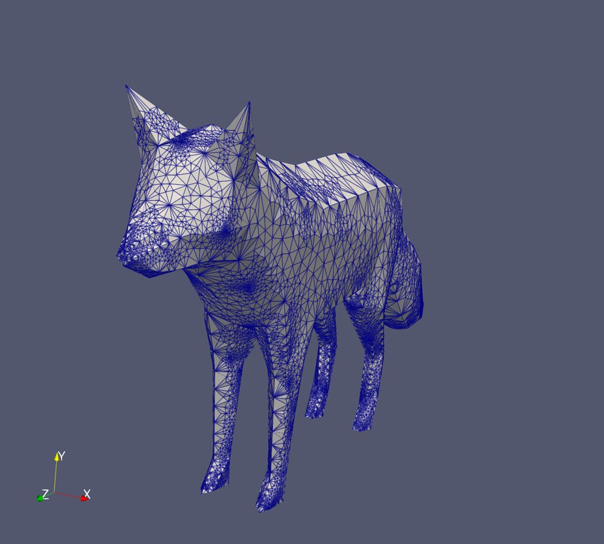
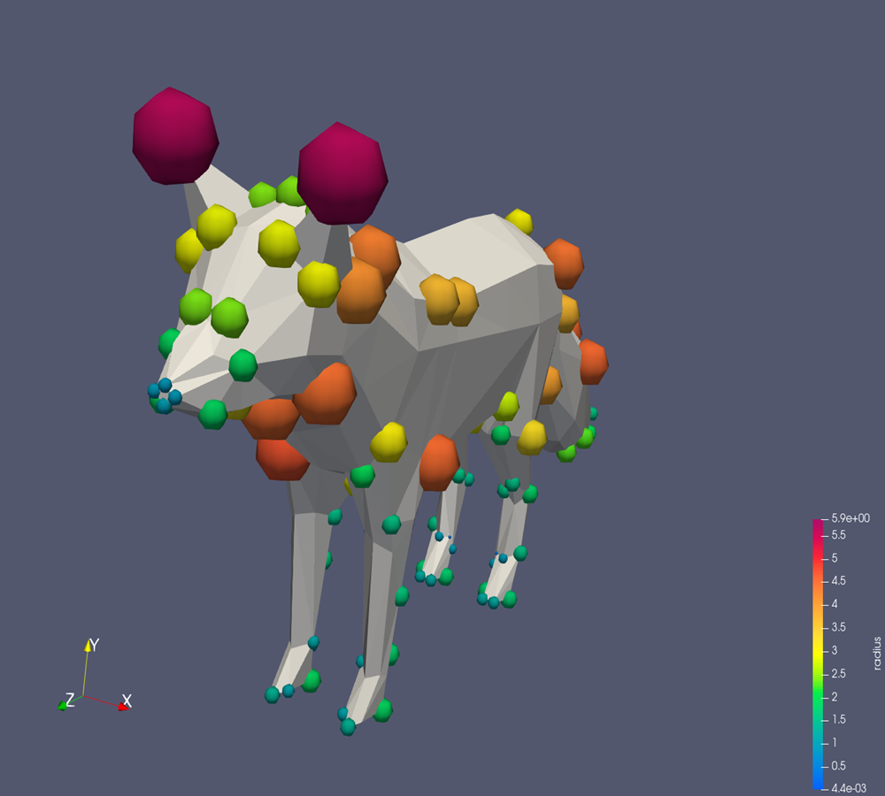
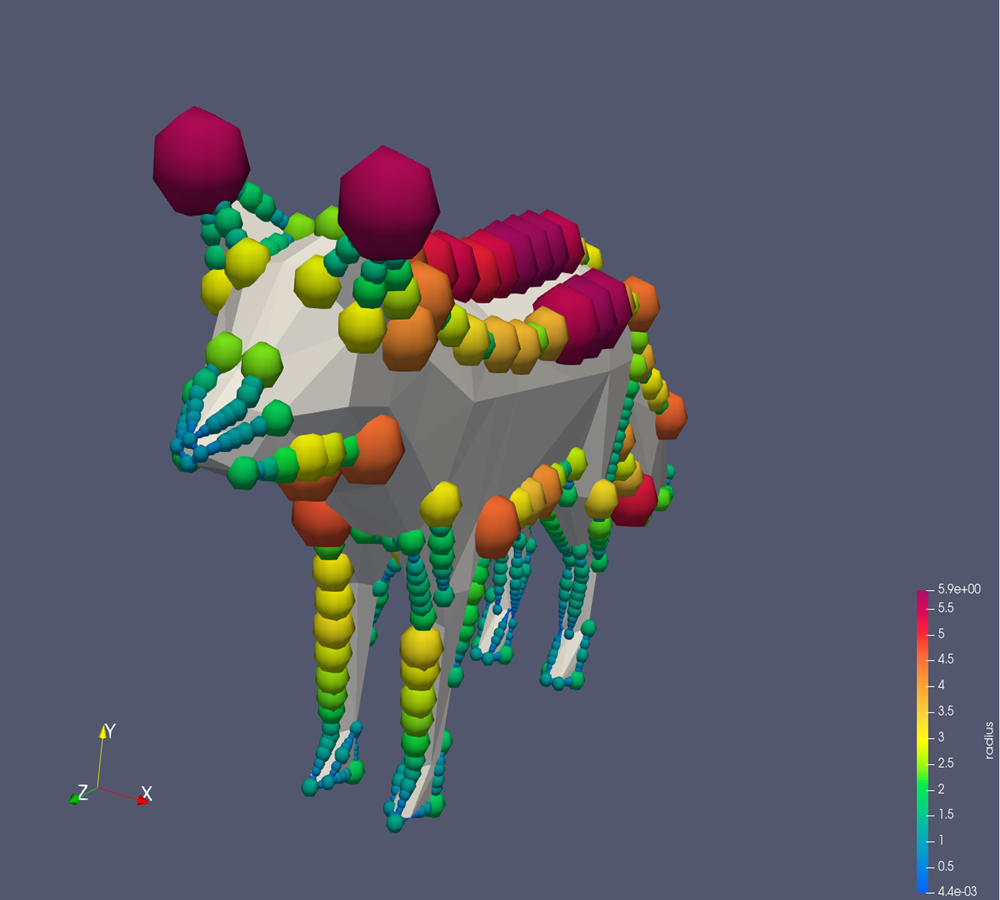
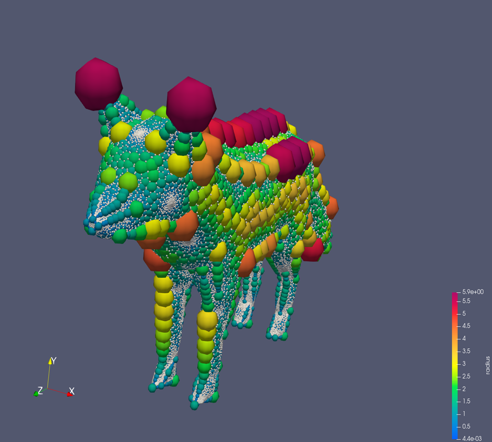

# VoroCrustRICH
## Overview

This repository contains an implementation of the algorithm described in "VoroCrust: Voronoi Meshing Without Clipping" by A. Abdelkader et al. (published in ACM Transactions on Graphics, 2020). 

## Input
The algorithm gets as input a 2D mesh

<p float="center">
  
   
</p>
<center> <h5>Input 2D Mesh, fox (right), Itokawa astroid (left)</h5> </center>

## Output
And outputs a set of Voronoi seeds, divided into `inside_seeds` and `outside_seeds` generating a Voronoi diagram whose boundary between the inside and outside approximates the input mesh to a good degree, preserving the mesh's sharp features. 

<p float="center">
  
   
</p>
<center> <h5>Output: Boundary or Voronoi Diagram, fox (right), Itokawa astroid (left) </h5> </center>

And fills the volume with a random sampled seeds s.t. the volume seeds do not interfere with the 

<p float="center">
  
   
</p>
<center> <h5>Output: Voronoi Diagram, Volume Mesh, fox (right), Itokawa astroid (left) </h5> </center>

## Steps

### Sharp Features Detection and Boundary Sampling

The first step is the detection of the sharp features and the creation of a discrete representation of the features using a K-D tree for fast nearest neighbors search.

<p float="center">
  
   
</p>
<center> <h5> Discrete representation of the features, fox (right), Itokawa astroid (left)</h5> </center>
<center> In blue the sharp vertices, in yellow the sharp edge sampling and in red the face sampling, fox edge sampling have 1e5 points and face sampling with 1e6, and the Itokawa astroid have 1e5 and 1e7 respectively</center>

## Ball Sampling

We then have the sharp vertex, sharp edges and then faces ball sampling, adjusting them iteratively in order to eliminate imprefections and impose a Lipschitzness condition of the cells.

<p float="center">
  
   
</p>
<center> <h5> After Edge Sampling, fox (right), Itokawa astroid (left) </h5> </center>

<p float="center">
  
   
</p>
<center> <h5> After Edge Sampling, fox (right), Itokawa astroid (left) </h5> </center>

<p float="center">
  
   
</p>
<center> <h5> After Face Sampling, fox (right), Itokawa astroid (left) </h5> </center>

## Generation of Boundary Voronoi Seeds

Seeds are then generated via trilateration of three spheres

<p float="center">
  
   
</p>
<center> <h5> Out Voronoi Seeds, inside there are corresponding In Voronoi Seeds, fox (right), Itokawa astroid (left) </h5> </center>

After the generation of the boundary seeds there is generation of the volume Voronoi Seeds.

### Citation

If you find this repository helpful, please consider citing the original paper 

```bibtex
@article{10.1145/3337680,
author = {Abdelkader, Ahmed and Bajaj, Chandrajit L. and Ebeida, Mohamed S. and Mahmoud, Ahmed H. and Mitchell, Scott A. and Owens, John D. and Rushdi, Ahmad A.},
title = {VoroCrust: Voronoi Meshing Without Clipping},
year = {2020},
issue_date = {June 2020},
publisher = {Association for Computing Machinery},
address = {New York, NY, USA},
volume = {39},
number = {3},
issn = {0730-0301},
url = {https://doi.org/10.1145/3337680},
doi = {10.1145/3337680}}
```

### Disclaimer
While I have made every effort to faithfully replicate the algorithm as described in the paper, this implementation is my independent work and may contain differences or assumptions not explicitly stated in the original publication.


## Requirements

The only non-standard packages I used were `pybind11`, `boost` and `vtk`. The most troublesome one was `vtk` and it is only used for the nice graphical output of the algorithm.
